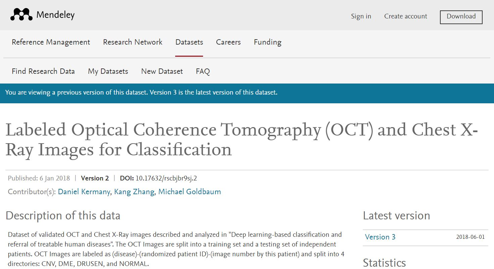
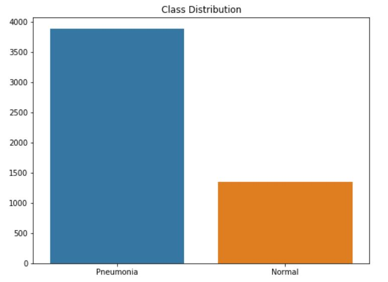
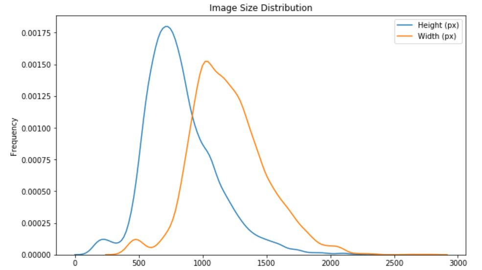
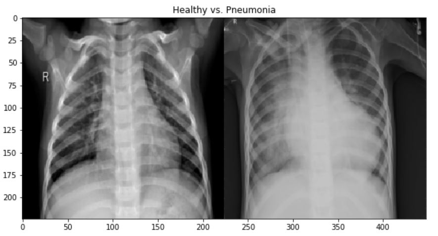
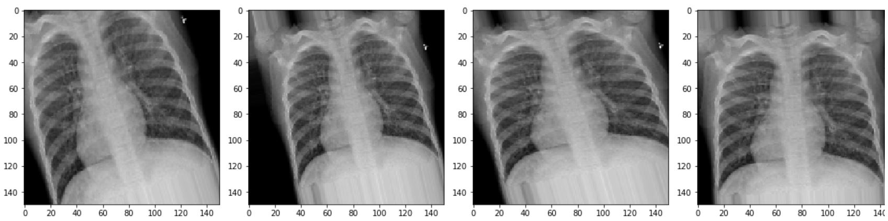

# DSI-CC9 Capstone Project

# Identifying Pneumonia by Chest X-Ray Images

I will build a convolutional neural network (CNN) to identify whether a patient has pneumonia or not by classifying their medical images. Recall shall be the success metric as there is a high risk associated with false negative classification when it comes to human diseases.

This project is adequately scoped and focuses on one specific type of disease rather than targeting multiple diagnosis. Therefore, there is a high chance to generate substentially accurate results.

Pneumonia is an infection that inflames lungs and can be diagnosed by radiologists who view the patient's chest x-rays. Creating an algorithm that provides accurate diagnosis can be beneficial for both patients and medical proffesionals.

## Data Guidelines

Source: https://data.mendeley.com/datasets/rscbjbr9sj/2
Published: 6 Jan 2018 | Version 2 | DOI: 10.17632/rscbjbr9sj.2
Contributor(s): Daniel Kermany, Kang Zhang, Michael Goldbaum

Kaggle link:
https://www.kaggle.com/paultimothymooney/chest-xray-pneumonia

Chest X-ray images (anterior-posterior) were selected from retrospective cohorts of pediatric patients of one to five years old from Guangzhou Women and Children’s Medical Center, Guangzhou. All chest X-ray imaging was performed as part of patients’ routine clinical care.

For the analysis of chest x-ray images, all chest radiographs were initially screened for quality control by removing all low quality or unreadable scans. The diagnoses for the images were then graded by two expert physicians before being cleared for training the AI system. In order to account for any grading errors, the evaluation set was also checked by a third expert.

**Train Dataset**

3883 .jpeg images labeled as PNEUMONIA (bacterial).
1349 .jpeg images labeled as NORMAL.

**Test Dataset**

390 .jpeg images labeled as PNEUMONIA (viral).
234 .jpeg images labeled as NORMAL.

## EDA

[Part 1 - Data_Exploration_EDA] notebook focuses on exploring data, analyzing an plotting insightful stats (class balance, image size distribution, etc.), loading data as 3-dimensional array, and preprocess data to prepare for modeling.

**Class Distribution**

**Image Size (Pixels) Distribution**

**Healthy vs. Pneumonia**

some additonal stuff here

## Data Preprocessing & Modeling

[Part 2 - Data_Preprocessing_Modeling] notebook focuses on preprocessing data to bring them optimal size and format using data augmentation parameters. Once the preprocessing complete, I will train various Tensorflow Keras "sequential" and ""convolutional" networks as well as pre-trained models to sample transfer learning to come up with best results. As the classes are imbalanced, my success metrics should be Precision and Recall. Specifically Recall score is the most important as our goal is to focus on minimizing false negative rates to not classify a patient as healthy while in fact they have pneumonia.

I manually checked the images and found that there are a lot of variations for such a small dataset. The hight/width ratio, zooming range, angle of the body etc features differ among differen Xray images. Even the physical dimensions of images are vastly different. This makes it harder to train a model that will give high accuracy rate. I decided to use generator class to generate more images within train data with optimal rotation_range, shear_range, zoom_range, horizontal_flip (mirroring randomly selected images) to get additional observations to train the model with.

 `  rescale=1./255,  
    rotation_range=20,  
    width_shift_range=0.1,  
    height_shift_range=0.1,  
    shear_range=0.1,  
    zoom_range=0.2,  
    horizontal_flip=True,  
    fill_mode='nearest')  
    
    **Augmented images**
    
    All images belong to same X-ray instance.
    
        `
 
 ## Transfer Learning
 
I decided to use the artichecture of a pre-trained model as I was curious about transfer learning outcome. Transfer learning is using a pre-trained model and its weights on a different dataset. I chose to create an instance from VGG16 convolutional neural network model which is popular from ImageNet competition. This would allow me to save a lot of time while testing the performance of my data with an additional model.

**VG166 Arthitecture**

Source: https://neurohive.io/en/popular-networks/vgg16/

